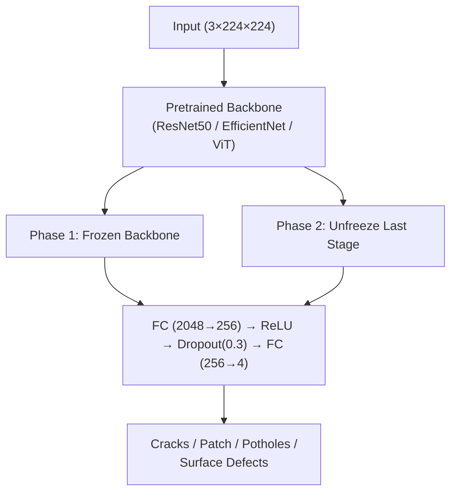
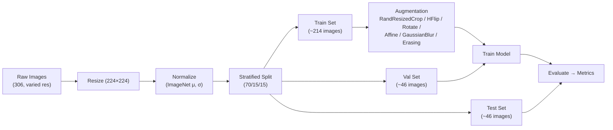

<div align="center">

# 🛣️ Surface Crack Detection

**AI-powered detection of road & bridge surface defects using Deep Learning**

[](https://python.org)
[](https://pytorch.org)
[](https://gradio.app)
[](https://fastapi.tiangolo.com)
[](https://huggingface.co/spaces/amruthjakku/surface-crack-detection)
[](https://wandb.ai/amruthjakku/surface-crack-detection)

**Live:** [huggingface.co/spaces/amruthjakku/surface-crack-detection](https://huggingface.co/spaces/amruthjakku/surface-crack-detection)

</div>

---

## 📋 Overview

A multi-class classifier that detects **4 types of surface defects** from images using transfer learning (ResNet50, EfficientNet-B0, ViT-B/16) with optional ensemble inference.

| Defect Class        | Samples | % of Dataset |
| :------------------ | ------: | :----------: |
| **Cracks**          |      73 |    23.9%     |
| **Patch**           |      42 |    13.7%     |
| **Potholes**        |      91 |    29.7%     |
| **Surface Defects** |     100 |    32.7%     |
| **Total**           | **306** |   **100%**   |

**Domain:** Manufacturing & Computer Vision  
**Framework:** PyTorch  
**Bootcamp:** ACE — Team 7

---

## 🧠 Architecture



---

## 🔬 Pipeline



---

## 🏋️ Training Strategy

| Phase             | Backbone             | Epochs |   LR   | Optimizer |
| :---------------- | :------------------- | :----: | :----: | :-------: |
| **1 — Warmup**    | Frozen               |   5    | 1×10⁻³ |   AdamW   |
| **2 — Fine-tune** | Unfreeze last stage  |   15   | 1×10⁻⁵ |   AdamW   |

| Detail               | Value                                           |
| :------------------- | :---------------------------------------------- |
| **Loss Function**    | Weighted CrossEntropy + label smoothing (ε=0.1) |
| **LR Scheduler**     | ReduceLROnPlateau (factor=0.5, patience=3)      |
| **Early Stopping**   | Patience = 7 epochs                             |
| **Model Checkpoint** | Monitor validation loss                          |
| **Regularization**   | Mixup (α=0.2, prob=0.5)                         |

---

## 🏋️ Training Environment

**Platform:** Google Colab (free T4 GPU) — [Open Notebook](notebooks/04_train_wandb.ipynb)
**Tracking:** [Weights & Biases Dashboard](https://wandb.ai/amruthjakku/surface-crack-detection)

### Model Performance Comparison

| Run | Model | Accuracy | Weighted F1 | Date | wandb Link |
|:----|:------|:--------:|:-----------:|:----:|:----------:|
| 1 | ResNet50 | 79.6% | 79.6% | Jul 2026 | — |
| 2 | EfficientNet-B0 | — | — | — | — |
| 3 | ViT-B/16 | — | — | — | — |
| 4 | **Ensemble** (R50+Eff) | — | — | — | — |

> Rows populate after each training session. Click wandb links for live charts & confusion matrices.

---

## 🏛️ Project Structure

```
bootcamp/
├── app.py                        # Gradio entry point
├── backend/                      # Application logic
│   ├── auth.py                   #   Hardcoded admin auth
│   ├── prediction.py             #   Model inference + severity
│   ├── database.py               #   Supabase client (optional)
│   └── main.py                   #   FastAPI wrappers
├── src/                          # Training pipeline
│   ├── config.py                 #   Hyperparameters
│   ├── dataset.py                #   Dataset + transforms
│   ├── model.py                  #   ResNet50 / EfficientNet / ViT
│   ├── train.py                  #   Training loop
│   ├── evaluate.py               #   Evaluation + metrics
│   └── prepare_data.py           #   Data splitting
├── data/                         # Processed dataset
├── notebooks/                    # EDA & results
├── models/                       # Trained checkpoints
├── migrations/                   # Database schemas
├── Dockerfile                    # Container support
├── requirements.txt              # Dependencies
├── PLAN.md                       # Technical plan
├── TEAM_ROADMAP.md               # Sprint roadmap
└── README.md                     # ← You are here
```

---

## 🚀 Quick Start

```bash
# 1. Install dependencies
pip install -r requirements.txt

# 2. Run Gradio app
gradio app.py

# 3. (Optional) Prepare dataset & train model
python src/prepare_data.py
python src/train.py
python src/evaluate.py
```
---

## 📊 Results

See **Model Performance Comparison** table above for all training runs tracked via wandb.

### Session 1 — ResNet50 (Baseline)

**Test Set — 49 images** | Accuracy: **79.6%** | Weighted F1: **79.6%** | Macro F1: **78.3%**

| Class | Precision | Recall | F1 | Support |
|:------|:--------:|:------:|:--:|:-------:|
| Cracks | 1.00 | 0.67 | 0.80 | 12 |
| Patch | 0.71 | 0.71 | 0.71 | 7 |
| **Potholes** ⭐ | 0.68 | **1.00** | **0.81** | 15 |
| Surface Defects | 0.92 | 0.73 | 0.81 | 15 |

> **Potholes achieve 100% recall** — every pothole image is correctly identified.
> Weighted loss with a 1.5× Pothole priority multiplier emphasizes this class during training.

---

## 🌐 Deployment

| Platform                |    SDK    |     Sleep?      | Setup                                                                          |
| :---------------------- | :-------: | :-------------: | :----------------------------------------------------------------------------- |
| **Hugging Face Spaces** | Gradio |   ❌ No sleep   | `git push hf main`                                                             |
| **Docker (any host)**   |  Docker   | Depends on host | `docker build -t crack-detection . && docker run -p 8501:8501 crack-detection` |

**Live:** [huggingface.co/spaces/amruthjakku/surface-crack-detection](https://huggingface.co/spaces/amruthjakku/surface-crack-detection)

---

<div align="center">

Built with ❤️ by **Team 7 — ACE Bootcamp**

</div>
```