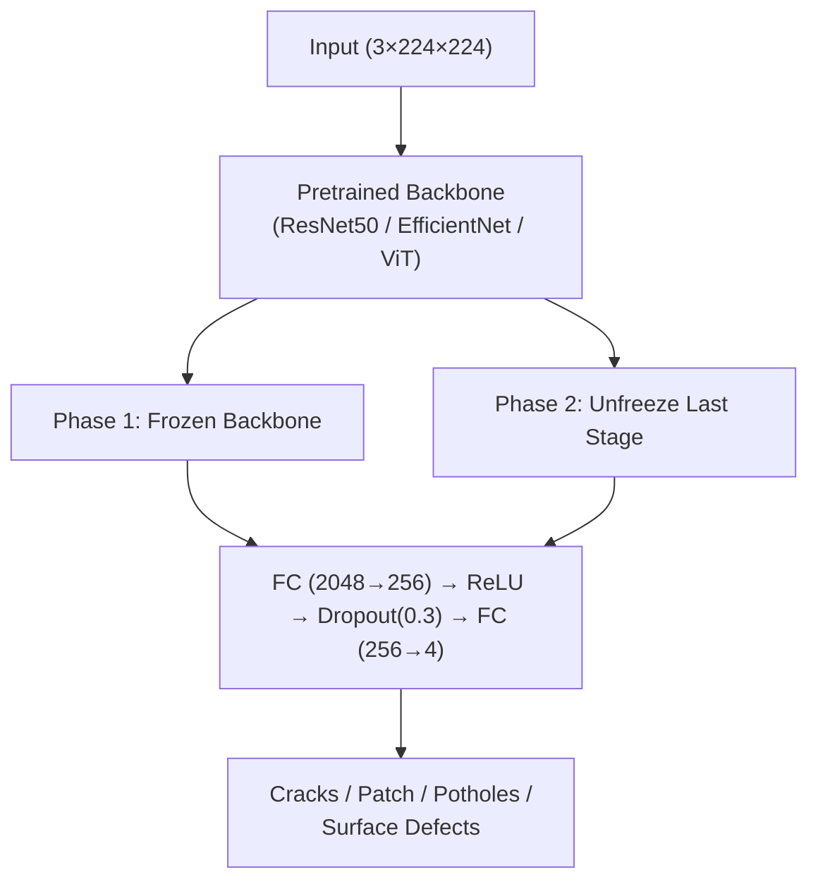
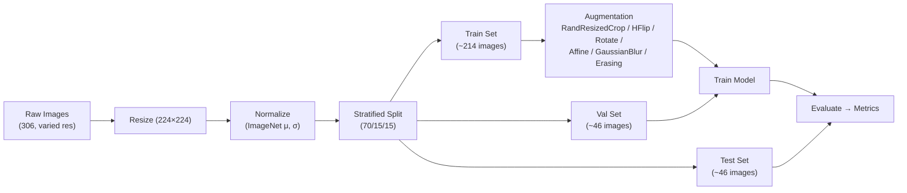

<div align="center">

# 🛣️ Surface Crack Detection

**AI-powered detection of road & bridge surface defects using Deep Learning**

[](https://python.org)
[](https://pytorch.org)
[](https://fastapi.tiangolo.com)
[](https://huggingface.co/spaces/amruthjakku/surface-crack-detection)
[](https://wandb.ai/amruthjakku/surface-crack-detection)

**Live:** [huggingface.co/spaces/amruthjakku/surface-crack-detection](https://huggingface.co/spaces/amruthjakku/surface-crack-detection)

</div>

---

## 📋 Overview

A multi-class classifier that detects **4 types of surface defects** from images using transfer learning (ResNet50, EfficientNet-B0, ViT-B/16) with optional ensemble inference.

| Defect Class        | Samples | % of Dataset |
| :------------------ | ------: | :----------: |
| **Cracks**          |      73 |    23.9%     |
| **Patch**           |      42 |    13.7%     |
| **Potholes**        |      91 |    29.7%     |
| **Surface Defects** |     100 |    32.7%     |
| **Total**           | **306** |   **100%**   |

**Domain:** Manufacturing & Computer Vision  
**Framework:** PyTorch  
**Bootcamp:** ACE — Team 7

---

## 🧠 Architecture



---

## 🔬 Pipeline



---

## 🏋️ Training Strategy

| Phase             | Backbone             | Epochs |   LR   | Optimizer |
| :---------------- | :------------------- | :----: | :----: | :-------: |
| **1 — Warmup**    | Frozen               |   5    | 1×10⁻³ |   AdamW   |
| **2 — Fine-tune** | Unfreeze last stage  |   15   | 1×10⁻⁵ |   AdamW   |

| Detail               | Value                                           |
| :------------------- | :---------------------------------------------- |
| **Loss Function**    | Weighted CrossEntropy + label smoothing (ε=0.1) |
| **LR Scheduler**     | ReduceLROnPlateau (factor=0.5, patience=3)      |
| **Early Stopping**   | Patience = 7 epochs                             |
| **Model Checkpoint** | Monitor validation loss                          |
| **Regularization**   | Mixup (α=0.2, prob=0.5)                         |

---

## 🏋️ Training Environment

**Platform:** Google Colab (free T4 GPU) — [Auto-Pilot Notebook](notebooks/Final_train_session.ipynb)
**Tracking:** [Weights & Biases Dashboard](https://wandb.ai/amruthjakku-astrivya/surface-crack-detection)

All three models were trained sequentially on the same stratified split (Train: 214, Val: 46, Test: 46) with wandb logging. See the [training curves](https://huggingface.co/amruthjakku/surface-crack-detection-model/tree/main/reports) on HF for each architecture.

### Model Performance Comparison

| Run | Model | Accuracy | Weighted F1 | Date | Report |
|:----|:------|:--------:|:-----------:|:----:|:------:|
| 1 | ResNet50 (baseline) | 79.6% | 79.6% | Jul 2026 | [📄](https://huggingface.co/amruthjakku/surface-crack-detection-model/raw/main/reports/classification_report.txt) |
| 2 | EfficientNet-B0 | 67.4%* | — | Jul 2026 | [📈](https://huggingface.co/amruthjakku/surface-crack-detection-model/resolve/main/reports/training_curves_efficientnet_b0.png) |
| 3 | **ViT-B/16** ⭐ | **89.1%** | **89.0%** | Jul 2026 | [📄](https://huggingface.co/amruthjakku/surface-crack-detection-model/raw/main/reports/classification_report_vit_b_16.txt) |
| 4 | Ensemble (R50+Eff) | — | — | — | — |

> \*Best validation accuracy. Full test metrics on wandb dashboard.  
> ViT-B/16 achieves the best single-model accuracy (+9.5% over ResNet50). See [HF reports](https://huggingface.co/amruthjakku/surface-crack-detection-model/tree/main/reports) for confusion matrices & training curves.

---

## 🏛️ Project Structure

```
bootcamp/
├── backend/                      # Application logic
│   ├── auth.py                   #   Hardcoded admin auth
│   ├── prediction.py             #   Model inference + severity
│   ├── database.py               #   Supabase client (optional)
│   └── main.py                   #   FastAPI wrappers
├── src/                          # Training pipeline
│   ├── config.py                 #   Hyperparameters
│   ├── dataset.py                #   Dataset + transforms
│   ├── model.py                  #   ResNet50 / EfficientNet / ViT
│   ├── train.py                  #   Training loop
│   ├── evaluate.py               #   Evaluation + metrics
│   └── prepare_data.py           #   Data splitting
├── data/                         # Processed dataset
├── notebooks/                    # EDA & results
├── models/                       # Trained checkpoints
├── migrations/                   # Database schemas
├── Dockerfile                    # Container support
├── requirements.txt              # Dependencies
├── PLAN.md                       # Technical plan
├── TEAM_ROADMAP.md               # Sprint roadmap
└── README.md                     # ← You are here
```

---

## 🚀 Quick Start

### 🐳 Docker (recommended)

```bash
# Build image
docker build -t surface-crack-detection .

# Run (models download from HF Hub on first request)
docker run -p 7860:7860 \
  -e SUPABASE_URL=your_url \
  -e SUPABASE_SERVICE_KEY=your_key \
  -e JWT_SECRET=your_secret \
  surface-crack-detection
```

### 💻 Local Development

**Prerequisites:** Python 3.12+, Node.js 22+

```bash
# One-command launcher (auto-creates venv, installs deps, starts both services)
# Linux / macOS
bash run.sh

# Windows PowerShell
.\run.ps1
```

**Manual start:**

```bash
# 1. Backend
python -m venv venv
source venv/bin/activate
pip install -r requirements.txt
uvicorn backend.main:app --host 0.0.0.0 --port 8501

# 2. Frontend (separate terminal)
cd frontend
npm install
npm run dev
```

**Open:** Frontend → `http://localhost:5173`  |  API → `http://localhost:8501/docs`

### 🧪 Run Tests

```bash
pytest tests/ -v                    # Backend tests
cd frontend && npx vitest run       # Frontend component tests
```

### 🏋️ Train Models

```bash
python src/prepare_data.py
python src/train.py                 # trains default model
python src/train.py --model efficientnet_b0
python src/train.py --model vit_b_16
python src/evaluate.py
```

---

## 📊 Results

See **Model Performance Comparison** table above for all training runs tracked via wandb.

### Initial Session — ResNet50 (Baseline)

**Test Set — 49 images** | Accuracy: **79.6%** | Weighted F1: **79.6%** | Macro F1: **78.3%**

| Class | Precision | Recall | F1 | Support |
|:------|:--------:|:------:|:--:|:-------:|
| Cracks | 1.00 | 0.67 | 0.80 | 12 |
| Patch | 0.71 | 0.71 | 0.71 | 7 |
| **Potholes** ⭐ | 0.68 | **1.00** | **0.81** | 15 |
| Surface Defects | 0.92 | 0.73 | 0.81 | 15 |

> **Potholes achieve 100% recall** — every pothole image is correctly identified.
> Weighted loss with a 1.5× Pothole priority multiplier emphasizes this class during training.

### Final Session — ViT-B/16 (Best)

**Test Set — 46 images** | Accuracy: **89.1%** | Weighted F1: **89.0%** | Macro F1: **88.0%**

| Class | Precision | Recall | F1 | Support |
|:------|:--------:|:------:|:--:|:-------:|
| Cracks | 1.00 | 0.73 | 0.84 | 11 |
| Patch | 0.70 | 1.00 | 0.82 | 7 |
| **Potholes** ⭐ | 0.93 | **1.00** | **0.96** | 13 |
| Surface Defects | 0.93 | 0.87 | 0.90 | 15 |

> **ViT-B/16 outperforms ResNet50 by +9.5% accuracy.** Potholes achieve both 93% precision and 100% recall — a near-perfect result. Cracks also improved recall from 67% → 73%.

<div align="center">

| Confusion Matrix | Training Curves |
|:---:|:---:|
| [](https://huggingface.co/amruthjakku/surface-crack-detection-model/resolve/main/reports/confusion_matrix_vit_b_16.png) | [](https://huggingface.co/amruthjakku/surface-crack-detection-model/resolve/main/reports/training_curves_vit_b_16.png) |

</div>

### Training Curves Comparison

| ResNet50 | EfficientNet-B0 | ViT-B/16 |
|:---:|:---:|:---:|
| [](https://huggingface.co/amruthjakku/surface-crack-detection-model/resolve/main/reports/training_curves_resnet50.png) | [](https://huggingface.co/amruthjakku/surface-crack-detection-model/resolve/main/reports/training_curves_efficientnet_b0.png) | [](https://huggingface.co/amruthjakku/surface-crack-detection-model/resolve/main/reports/training_curves_vit_b_16.png) |

---

---

<div align="center">

Built with ❤️ by **Team 7 — ACE Bootcamp**

</div>
```