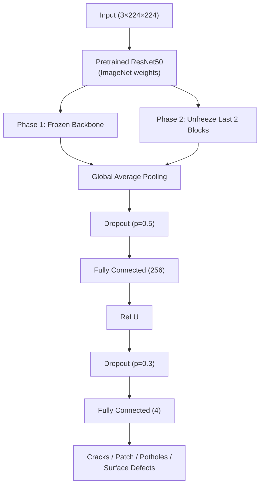
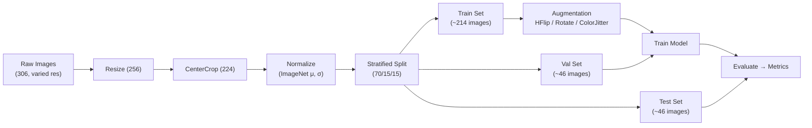

<div align="center">

# 🛣️ Surface Crack Detection

**AI-powered detection of road & bridge surface defects using Deep Learning**

[](https://python.org)
[](https://pytorch.org)
[](https://streamlit.io)
[](https://fastapi.tiangolo.com)
[](https://huggingface.co/spaces/amruthjakku/surface-crack-detection)
[](LICENSE)

**Live:** [huggingface.co/spaces/amruthjakku/surface-crack-detection](https://huggingface.co/spaces/amruthjakku/surface-crack-detection)

</div>

---

## 📋 Overview

A multi-class classifier that detects **4 types of surface defects** from images using transfer learning on ResNet50 / EfficientNet-B0.

| Defect Class        | Samples | % of Dataset |
| :------------------ | ------: | :----------: |
| **Cracks**          |      73 |    23.9%     |
| **Patch**           |      42 |    13.7%     |
| **Potholes**        |      91 |    29.7%     |
| **Surface Defects** |     100 |    32.7%     |
| **Total**           | **306** |   **100%**   |

**Domain:** Manufacturing & Computer Vision  
**Framework:** PyTorch  
**Bootcamp:** ACE — Team 7

---

## 🧠 Architecture



---

## 🔬 Pipeline



---

## 🏋️ Training Strategy

| Phase             | Backbone               | Epochs |   LR   | Optimizer |
| :---------------- | :--------------------- | :----: | :----: | :-------: |
| **1 — Warmup**    | Frozen                 |  5–10  | 1×10⁻³ |   AdamW   |
| **2 — Fine-tune** | Unfreeze last 2 blocks | 15–25  | 1×10⁻⁵ |   AdamW   |

| Detail               | Value                                           |
| :------------------- | :---------------------------------------------- |
| **Loss Function**    | Weighted CrossEntropy (inverse class frequency) |
| **LR Scheduler**     | CosineAnnealingLR                               |
| **Early Stopping**   | Patience = 7 epochs                             |
| **Model Checkpoint** | Monitor validation F1                           |
| **Mixed Precision**  | `torch.cuda.amp` (if GPU available)             |

---

## 🏛️ Project Structure

```
bootcamp/
├── app.py                        # Streamlit entry point
├── pages/                        # Streamlit pages (login, home)
├── backend/                      # Application logic
│   ├── auth.py                   #   Hardcoded admin auth
│   ├── prediction.py             #   Model inference + severity
│   ├── database.py               #   Supabase client (optional)
│   └── main.py                   #   FastAPI wrappers
├── src/                          # Training pipeline
│   ├── config.py                 #   Hyperparameters
│   ├── dataset.py                #   Dataset + transforms
│   ├── model.py                  #   ResNet50 / baseline CNN
│   ├── train.py                  #   Training loop
│   ├── evaluate.py               #   Evaluation + metrics
│   └── prepare_data.py           #   Data splitting
├── data/                         # Processed dataset
├── notebooks/                    # EDA & results
├── models/                       # Trained checkpoints
├── migrations/                   # Database schemas
├── Dockerfile                    # Container support
├── requirements.txt              # Dependencies
├── PLAN.md                       # Technical plan
├── TEAM_ROADMAP.md               # Sprint roadmap
└── README.md                     # ← You are here
```

---

## 🚀 Quick Start

```bash
# 1. Install dependencies
pip install -r requirements.txt

# 2. Run Streamlit app (direct imports — no separate server needed)
streamlit run app.py

# 3. (Optional) Prepare dataset & train model
python src/prepare_data.py
python src/train.py
python src/evaluate.py
```

**Login Credentials (hardcoded):**  
`Email:` admin@surfacedetect.com  
`Password:` Admin@123

---

## 🌐 Deployment

| Platform                |    SDK    |     Sleep?      | Setup                                                                          |
| :---------------------- | :-------: | :-------------: | :----------------------------------------------------------------------------- |
| **Hugging Face Spaces** | Streamlit |   ❌ No sleep   | `git push hf main`                                                             |
| **Docker (any host)**   |  Docker   | Depends on host | `docker build -t crack-detection . && docker run -p 8501:8501 crack-detection` |

**Live:** [huggingface.co/spaces/amruthjakku/surface-crack-detection](https://huggingface.co/spaces/amruthjakku/surface-crack-detection)

---

<div align="center">

Built with ❤️ by **Team 7 — ACE Bootcamp**

</div>
